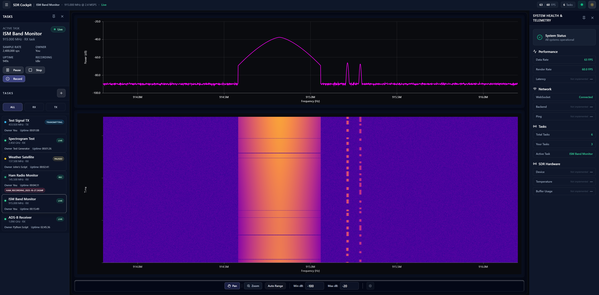
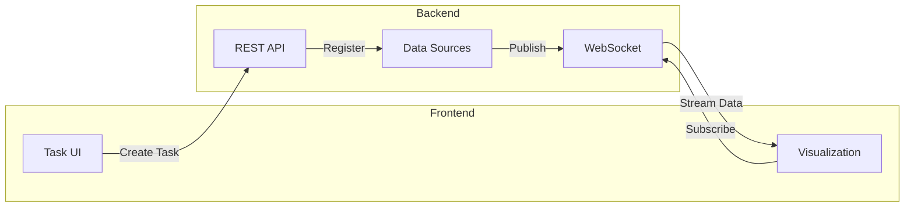

# SDR Cockpit

[](https://github.com/tccoult/sdr-cockpit/actions/workflows/ci.yml)

A modern web application for controlling and monitoring Software Defined Radio (SDR) systems with real-time visualizations and multi-user support.



## Overview

SDR Cockpit provides an intuitive interface for tasking SDR hardware, visualizing RF data in real-time, and managing multiple simultaneous receive/transmit operations. Built for both interactive exploration and programmatic control of SDR systems.

## Key Features

- **Real-time Visualizations**: Multiple display modes including FFT-only, FFT-waterfall, and full spectrogram views
- **Multi-tasking Support**: Handle multiple simultaneous RX/TX operations with pause/resume control
- **Task Recording**: Record RF data in real-time with status indicators and metadata
- **Task Attachment**: Connect to existing data streams from other users or processes
- **SigMF Integration**: Record and playback using the Signal Metadata Format standard
- **Transmit Capability**: Upload and transmit SigMF files with progress tracking
- **System Health Monitoring**: Built-In Test (BIT) results with hierarchical tree view of hardware/function status
- **System Updates**: Managed update lifecycle with lock mechanism, upload, and installation progress
- **Multi-user Support**: Collaborative SDR operations with task ownership tracking
- **WebSocket Streaming**: Real-time data streaming with Zstandard compression
- **Modern UI**: Clean, responsive interface with dark/light themes using shadcn/ui components

## Architecture

The system follows a **source-based streaming model** where tasks create data sources that web clients can subscribe to via WebSocket connections.

### Data Flow Overview



### Flow Description

1. **Task Creation**: User creates an RX/TX task → Backend registers a new data source
2. **Source Discovery**: Frontend polls for available sources → Displayed in source selector
3. **Client Attachment**: User selects source → WebSocket connection established → Client subscribed to source
4. **Data Streaming**: Source generates FFT data → Published to all subscribed clients via WebSocket
5. **Visualization**: Clients receive protobuf-encoded frames → Decoded and rendered in real-time

### Key Design Patterns

- **Lazy Activation**: Sources only generate data when subscribers are attached
- **Backpressure Handling**: Queue overflow drops oldest frames to maintain real-time performance
- **Multi-user Support**: Multiple clients can subscribe to the same source simultaneously

## Prerequisites

### For Development (Dev Container - Recommended)

- [Docker](https://docs.docker.com/get-docker/) & [Docker Compose](https://docs.docker.com/compose/install/)
- [VSCode](https://code.visualstudio.com/) with [Dev Containers extension](https://marketplace.visualstudio.com/items?itemName=ms-vscode-remote.remote-containers)

The dev container includes all required tools (Node.js 20, Python 3.11, uv package manager).

### For Local Development (Without Dev Container)

- [Node.js 20+](https://nodejs.org/) (frontend)
- [Python 3.11+](https://www.python.org/) (backend/simulator)
- [uv](https://docs.astral.sh/uv/) (Python package manager)
- [Docker](https://docs.docker.com/get-docker/) & [Docker Compose](https://docs.docker.com/compose/install/) (for Redis and production builds)

### For Production Deployment

- Docker & Docker Compose
- (Optional) systemd for service deployment
- (Optional) RPM packaging tools for air-gapped deployment

## Technology Stack

- **Frontend**: React 18 + TypeScript + Vite
- **Backend**: Python 3.11 + FastAPI
- **Simulator**: Python 3.11 + NumPy (mock SDR data generator)
- **Development**: VSCode Dev Container (Alma Linux 9)
- **Deployment**: Docker container + systemd service

## Getting Started

### Development

**Quick start:**

```bash
./scripts/setup.sh    # Install dependencies (first time only)
./scripts/dev.sh      # Start dev environment
```

This starts the frontend (http://localhost:5173) and backend (http://localhost:8000) with hot reload.

**Run tests:**

```bash
./scripts/test.sh     # Run all test suites
./scripts/check.sh    # Run full CI checks (lint, type-check, test, build)
```

### Production

**Build and deploy:**

```bash
./scripts/build-prod.sh        # Build container
./scripts/run-prod-local.sh    # Test locally
sudo ./scripts/deploy-systemd.sh  # Deploy as systemd service
```

For air-gapped deployments, use `./scripts/build-rpm.sh` to create a bundled RPM package.

## API Documentation

- **API Reference**: https://tccoult.github.io/sdr-cockpit/api/
- **Live Swagger UI**: http://localhost:8000/docs (when backend is running)

### OpenAPI-First Development

The API specification in `api/openapi.yaml` serves as the **single source of truth** for both frontend and backend. Types are auto-generated to ensure consistency:

```bash
./scripts/generate-types.sh    # Regenerate all types from OpenAPI spec
```

This generates:
- **Frontend**: TypeScript types in `frontend/src/types/generated/api.ts`
- **Backend**: Pydantic models in `backend/app/models/generated.py`

The OpenAPI spec is modularized with schemas in `api/schemas/` for tasks, sources, health, updates, and common types.

## Project Structure

```
sdr-cockpit/
├── frontend/              # React 18 + TypeScript + Vite
│   ├── src/
│   │   ├── components/    # React components (UI, settings, tasks, visualization)
│   │   ├── hooks/         # Custom React hooks (API, state management)
│   │   ├── services/api/  # Auto-generated API client
│   │   ├── types/generated/  # Auto-generated TypeScript types
│   │   └── plot/          # Visualization engine (FFT, waterfall, spectrogram)
│   └── package.json
├── backend/               # Python 3.11 + FastAPI
│   ├── app/
│   │   ├── api/routes/    # API route handlers
│   │   ├── api/websocket.py  # WebSocket connection management
│   │   ├── models/        # Pydantic models (auto-generated)
│   │   ├── sources/       # Data source management
│   │   └── config/        # Settings and constants
│   └── pyproject.toml
├── simulator/             # Mock SDR data generator
│   └── pyproject.toml
├── api/                   # OpenAPI specification (single source of truth)
│   ├── openapi.yaml       # Main API spec
│   └── schemas/           # Modular schema definitions
├── docker/                # Container definitions
├── scripts/               # Development and deployment scripts
├── docs/                  # Documentation and images
├── .devcontainer/         # VSCode dev container (AlmaLinux 9)
└── .github/workflows/     # CI/CD pipelines
```

## Contributing

This is currently a personal project, but contributions and suggestions are welcome!

## License

TBD

---

**Status**: 🚧 Active Development
